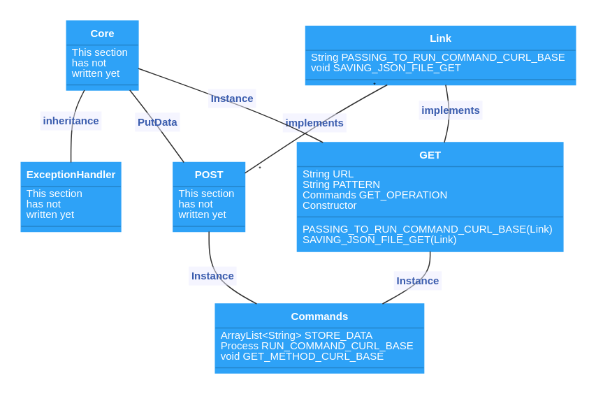

HTTP Communication
[](https://github.com/Mehranalam/HTTP-Communication/actions/workflows/maven.yml)
==================

This library is actually a shell of cURL and provides ``CURL`` features and functions under classes and interfaces for use in Java and ``Android projects``.  This library is expected to run on all platforms under the ``JVM``, the CURL tool is a platform-independent terminal kit with a long history.

Despite numerous and optimal libraries, perhaps using this library is not a suitable option, but in the future it may be able to compete with similar examples. Currently, the purpose of this library is to understand how a library communicates with the network, that in the lower layers of requests And how the answers are exchanged.

```java
import ir.mehranalam.cURL.Templates.Commands;

import java.io.IOException;

public class Main {
    public static void main(String[] args) throws IOException {
        System.out.println("I,am HTTP Communication");

        Commands test = new Commands();
        test.GET_METHOD_CURL_BASE(test
                .RUN_COMMAND_CURL_BASE("curl -X GET https://saurav.tech/NewsAPI/sources.json"));

        System.out.println(test.STORE_DATA.get(0));
    }
}

```

Licensed under the ``Apache License``, Version 2.0 (the "License");
you may not use this file except in compliance with the License.
You may obtain a copy of the License at ``http://www.apache.org/licenses/LICENSE-2.0`` 
Unless required by applicable law or agreed to in writing, softwaredistributed
under the License is distributed on an "AS IS" BASIS, WITHOUT WARRANTIES OR CONDITIONS OF ANY KIND, 
either express or implied.See the License for the specific language governing permissions and limitations under the License.


